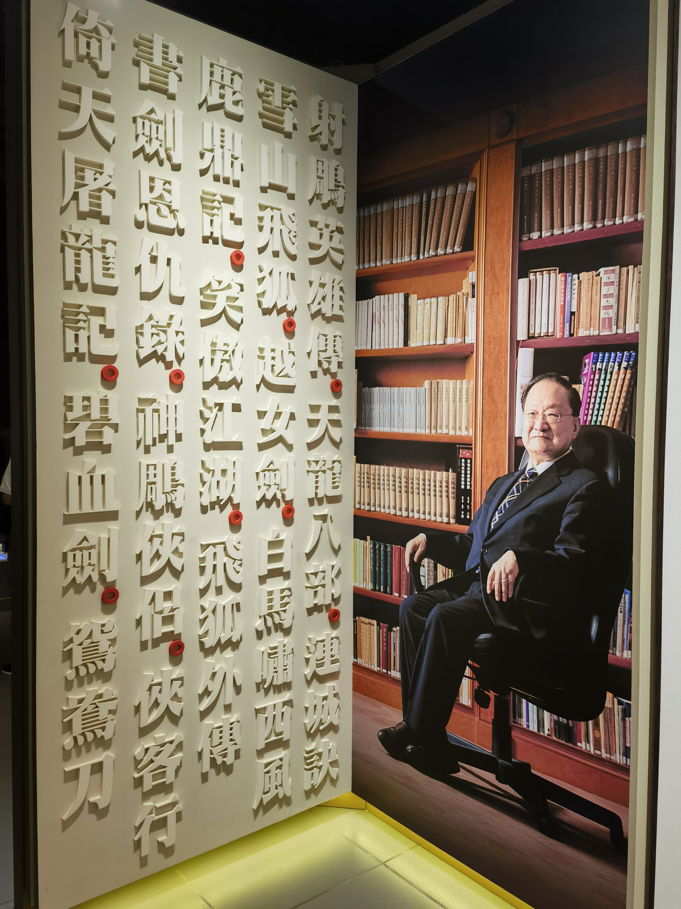
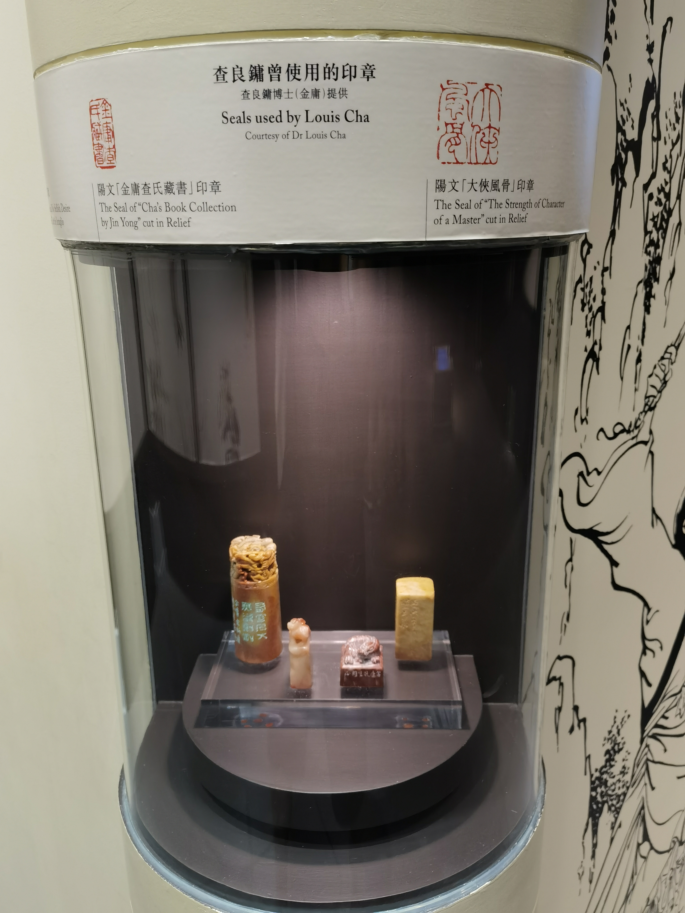
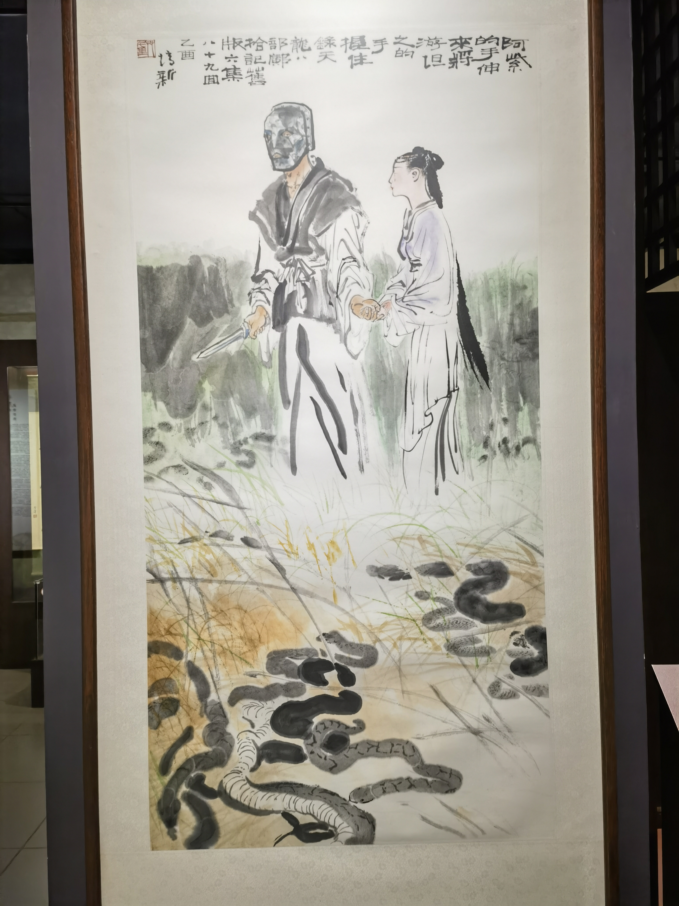
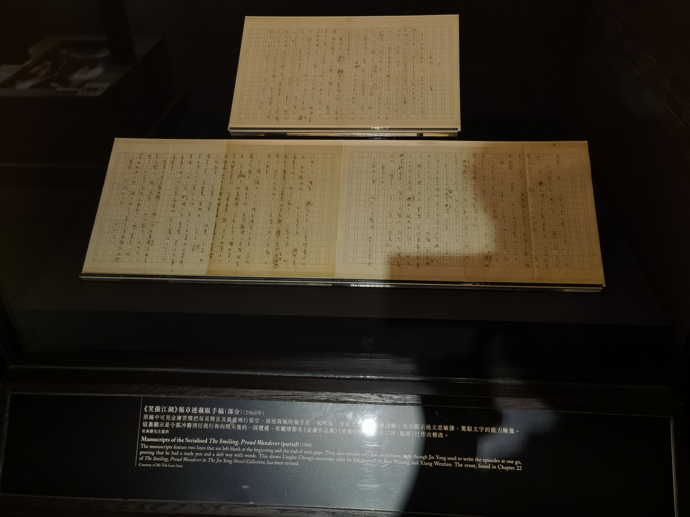
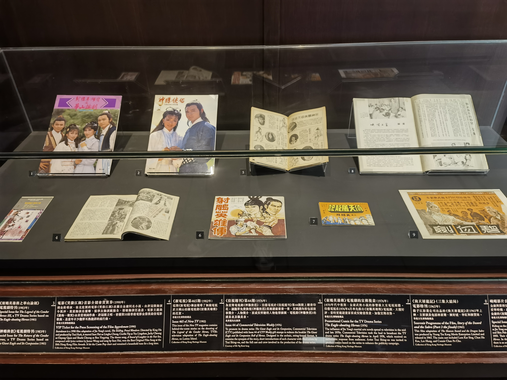
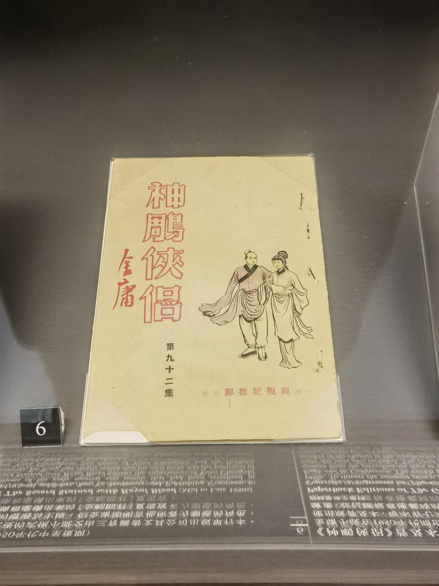
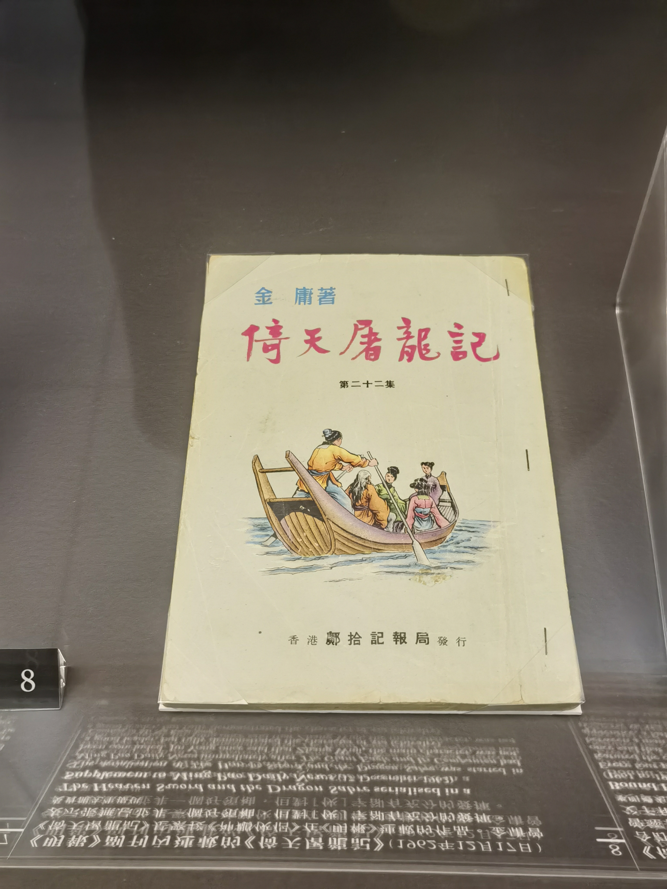
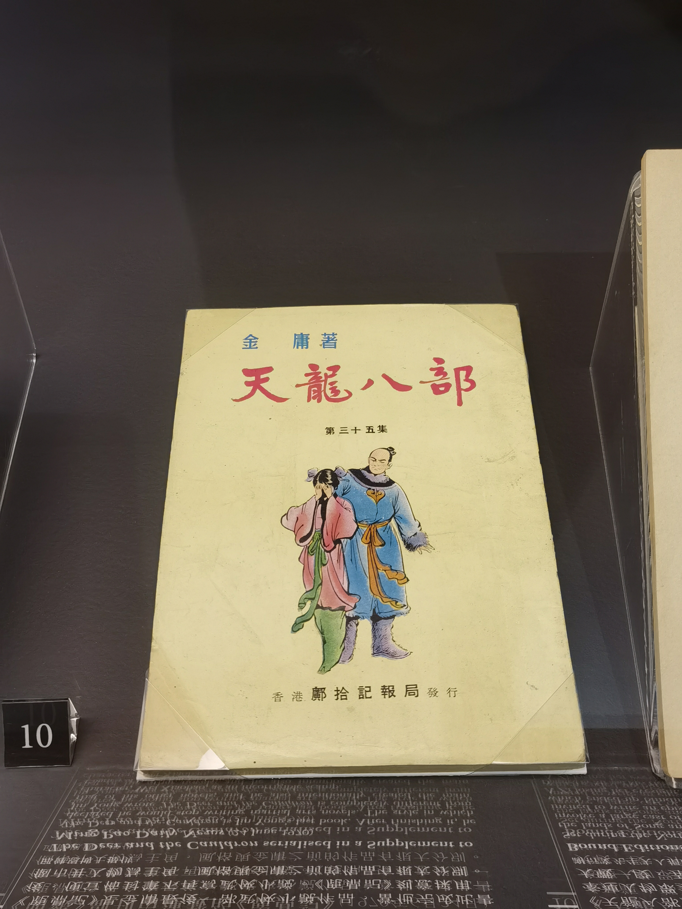
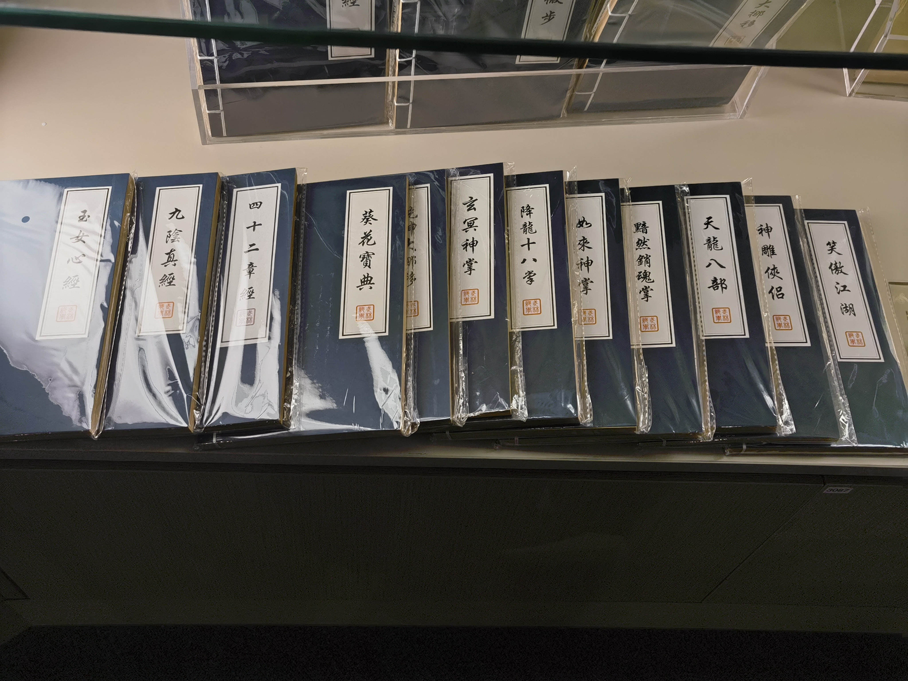

## Location

香港新界沙田文林路一号

1 Man Lam Road, Sha Tin, Hong Kong

[Online Map](https://www.map.gov.hk/gm/gmid/aI9wLekamv?lg=en)

## Photos

### Dr. Louis Cha

### Seals

### Animation

### Books

### Media

## Links

https://hk.heritage.museum/sc/web/hm/exhibitions/permanent_exhibitions/permanent_jin-yong-gallery.html

https://hk.heritage.museum/sc/web/hm/aboutus/themuseum.html