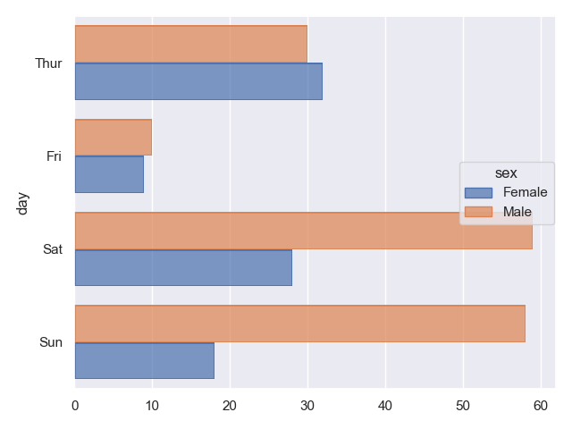
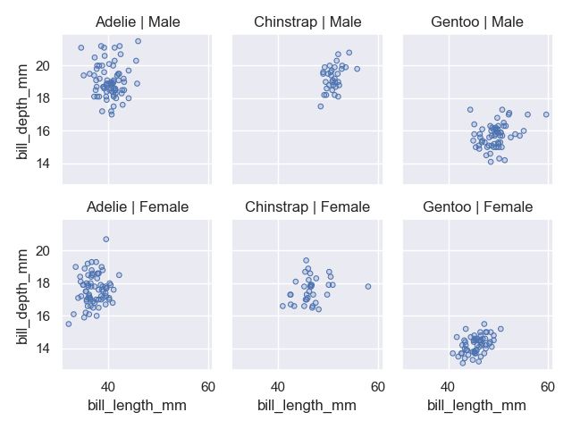
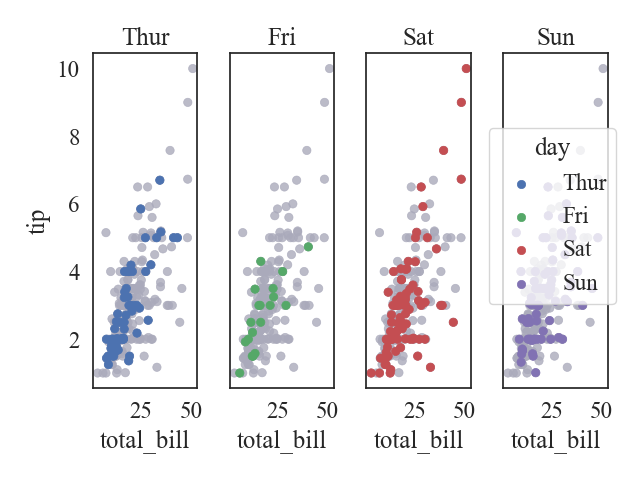

## Introduction

[**Seaborn**](https://seaborn.pydata.org/) is a Python data visualization library based on [matplotlib](https://matplotlib.org/). It provides a high-level interface for drawing attractive and informative statistical graphics.

Seaborn website: https://seaborn.pydata.org/

Seaborn Github: https://github.com/mwaskom/seaborn

## Dependencies

Seaborn supports Python 3.8+.

Installation requires numpy, pandas, and matplotlib. Some advanced statistical functionality requires scipy and/or statsmodels.

## Installation

```zsh
pip install seaborn
```

## Object Interface

In version 0.12, Seaborn introduced [**object namespace and interface**](https://seaborn.pydata.org/tutorial/objects_interface.html), which are based on the Grammar of Graphics similiar to [ggplot2](https://ggplot2-book.org/) package in R. In the past, the best python package was [plotnine](https://plotnine.readthedocs.io/en/stable/index.html) that was absolutely consistent with [ggplot2](https://ggplot2-book.org/).

## Example

### Basic Plot

```python
import seaborn
import seaborn.objects as so

tips=seaborn.load_dataset("tips")

(
    so.Plot(tips, y="day", color="sex")
    .add(so.Bar(), so.Hist(), so.Dodge())
    .show()
)
```

Then figure will be like this



If you want to save the figure, just run

```python
import seaborn as sns
import seaborn.objects as so

tips=sns.load_dataset("tips")

(
    so.Plot(tips, y="day", color="sex")
    .add(so.Bar(), so.Hist(), so.Dodge())
    .save("fig.pdf",bbox_inches="tight") ## save
)
```
bbox_inches="tight" is necessary for saving legend like R.

### Facet

```python
import seaborn as sns
import seaborn.objects as so

penguins=sns.load_dataset("penguins")

(
    so.Plot(penguins, "bill_length_mm", "bill_depth_mm")
    .add(so.Dots())
    .facet("species", "sex")
    .show()
)
```


### Theme and Palette

```python
import seaborn as sns
import seaborn.objects as so
import matplotlib.pyplot as plt

sns.set_theme(style="white", palette="deep6", font="Times New Roman", font_scale=1.5) ## settings

tips=sns.load_dataset("tips")

(
    so.Plot(tips, "total_bill", "tip", color="day")
    .facet(col="day")
    .add(so.Dot(color="#aabc"), col=None, color=None)
    .add(so.Dot())
    .theme(plt.rcParams) ## important
    .show()
)
```




## Reference

https://seaborn.pydata.org/api.html#objects-api

https://seaborn.pydata.org/tutorial/objects_interface.html